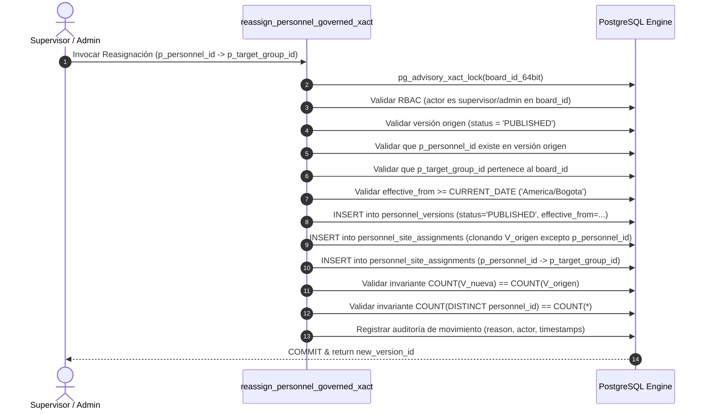

# ADR-C1.2C: Arquitectura de Movilidad Gobernada de Personal y Versionado Temporal de Asignaciones

## Estado
🟢 **DESIGN COMPLETE / APPROVED AS CANONICAL SPECIFICATION** (Implementación, DDL, RPC y UI estrictamente bloqueados hasta apertura formal de fase de implementación - STRICTLY NO-GO)

---

## 1. Contexto y Motivación

En el incremento **C1.1**, se integró en `/my-work` la visualización fiel y honesta del personal adscrito a cada sitio operacional consumiendo la versión activa (`personnel_versions` + `personnel_site_assignments`).

El **Discovery Forense C1.2-B** demostró que:
1. `effective_from` existe en `personnel_versions` pero **no gobierna la resolución de la versión vigente**; la consulta actual (`getActivePersonnelVersion`) solo evalúa `is_active = true ORDER BY created_at DESC LIMIT 1`.
2. No existe en base de datos una constraint `UNIQUE` que impida múltiples versiones con `is_active = true` para el mismo `board_id`.
3. No existe una función o RPC atómica (`activate_personnel_version_xact`) ni un mecanismo de clonación/mutación de snapshots.
4. Las tablas `weekly_plan_items`, `weekly_plan_item_executions` y `acta_items` **no mantienen claves foráneas (FK)** hacia `personnel_versions` ni `personnel_site_assignments`, lo que garantiza que la creación de nuevas versiones de personal no muta directamente ejecuciones pasadas ni actas emitidas.

Para permitir que un supervisor o administrador programe la reasignación de personal entre frentes de trabajo (ej. trasladar un operario de *Plaza Puerto Colombia* a *Malecón Sector 1* a partir del 1 de octubre) sin alterar la operación de hoy (25 de septiembre) y sin corromper la trazabilidad histórica, es indispensable definir formalmente el **contrato temporal, el ciclo de vida de versiones, la unicidad en base de datos y la atomicidad transaccional**.

---

## 2. Comparación Explícita de Alternativas Arquitectónicas

### Alternativa A: Resolución Temporal Pura por `effective_from`
En este modelo, no existe la columna `is_active`. La versión vigente para una fecha objetivo $D$ es aquella con $\max(\text{effective\_from}) \le D$.
- **Ventajas:** Conceptualmente pura; permite programar múltiples versiones futuras ($V_2$ para 01/10, $V_3$ para 15/10) sin procesos batch de activación.
- **Riesgos:** Una versión creada en borrador o con errores entraría en vigencia automáticamente al llegar la fecha sin validación humana previa. Dificulta archivar o invalidar versiones erróneas sin eliminarlas físicamente.
- **Impacto en `/my-work`:** Requiere que `/my-work` pase siempre la fecha operativa (`America/Bogota`).
- **Impacto en Modelo Actual:** Ruptura de retrocompatibilidad con el código actual que asume `is_active`.

### Alternativa B: Conmutación Explícita Exclusiva (`is_active = true`)
En este modelo, solo existe una versión activa a la vez. Al crear $V_2$, se desactiva $V_1$ y se activa $V_2$ inmediatamente.
- **Ventajas:** Implementación simple; coincide con el comportamiento actual de `getActivePersonnelVersion()`.
- **Riesgos:** **Invalida completamente la movilidad programada en el futuro.** Si un traslado es para el 01/10, no puede registrarse hoy 25/09 sin cambiar inmediatamente el personal de hoy en `/my-work`. Si se guarda como `is_active = false`, nadie la activa el 01/10 a menos que un operador humano lo haga manualmente a medianoche.
- **Impacto en `/my-work`:** Inconsistencia operativa (muestra personal del futuro en el presente o requiere conmutación manual).

### Alternativa C (Seleccionada): Modelo Híbrido Gobernado (Ciclo de Vida + Ventana Temporal)
El modelo desacopla el **estado de gobernanza de la versión** (`status: 'DRAFT' | 'PUBLISHED' | 'ARCHIVED'`) de su **ventana de vigencia temporal** (`effective_from`).
Una versión solo es elegible para una fecha operativa $D$ si cumple:
$$\text{version.status} = \text{'PUBLISHED'} \quad \land \quad \text{version.effective\_from} \le D$$
La versión vigente para la fecha $D$ es la de mayor `effective_from` entre las elegibles.

- **Ventajas:**
  1. Permite preparar y publicar hoy una versión futura ($V_2$ con `effective_from = '2026-10-01'`) con estatus `PUBLISHED`.
  2. Hoy 25/09, `/my-work` resuelve $V_1$ (`effective_from = '2026-09-08'`) porque $V_2$ aún no cumple $\text{effective\_from} \le \text{'2026-09-25'}$.
  3. El 01/10, `/my-work` resuelve automáticamente $V_2$ sin requerir un cron ni intervención manual.
  4. Elimina la ambigüedad semántica de `is_active`, estableciendo una fuente única y determinista de verdad temporal.
- **Riesgos:** Requiere que todas las consultas de asignaciones especifiquen explícitamente la fecha de contexto operativo (default: fecha actual en `America/Bogota`).
- **Impacto en `/my-work`:** 0 drift; `/my-work` ya opera bajo contexto de fecha diaria (`selectedDate` o fecha actual de Bogotá).
- **Complejidad Transaccional:** Media-Alta (resuelto mediante RPC atómica en PostgreSQL).

---

## 3. Decisión Arquitectónica (DECISION)

Se adopta la **Alternativa C: Modelo Híbrido Gobernado** con **Deprecación Explícita de Semántica de Dominio en `is_active` (Opción 1)**.

### 3.1. Taxonomía de Estados y Ciclo de Vida de Versiones

| Estado Contractual | Condición respecto a Fecha $D$ | Significado Operacional e Histórico |
| :--- | :--- | :--- |
| **`DRAFT`** | No aplica | En preparación / edición por supervisor; no elegible para consultas operativas de campo. |
| **`PROGRAMADA` (Futura)** | `status = 'PUBLISHED'` $\land$ `effective_from > D` | Aprobada y congelada; entrará en vigencia automáticamente cuando la fecha operativa alcance `effective_from`. |
| **`VIGENTE` (Actual)** | `status = 'PUBLISHED'` $\land$ `effective_from <= D` (siendo $\max(\text{effective\_from})$) | Gobierna la asignación de personal para el día $D$. Es la que consume `/my-work` hoy. |
| **`HISTÓRICA` (Superada)** | `status = 'PUBLISHED'` $\land$ `effective_from < D` (existiendo otra versión posterior con `effective_from <= D`) | Snapshot congelado que gobernó en el pasado. **Permanece en `status = 'PUBLISHED'`** para permitir reconstruir con fidelidad 100% quién estaba en cada frente en cualquier fecha pasada. |
| **`ARCHIVED` (Invalida)** | `status = 'ARCHIVED'` | Versión explícitamente revocada o descartada administrativamente antes de su vigencia o por anulación formal. Queda excluida de toda consulta operativa regular. |

### 3.2. Deprecación Formal de `is_active` (Adopción Opción 1)
1. **Pérdida de Semántica de Dominio:** `is_active` **deja de significar "vigente ahora"**.
2. **Rol Estricto de Compatibilidad Heredada:** `is_active` queda clasificado formalmente como `LEGACY / COMPATIBILITY FIELD / NO DOMAIN SEMANTICS`.
3. **Prohibición de Consumo en Dominio:** Ningún servicio nuevo ni refactorizado consumirá `is_active` para deducir elegibilidad ni vigencia de personal.
4. **Semántica Canónica Exclusiva:**
   $$\text{Semántica Canónica} \iff (\text{status}, \text{effective\_from}) \xrightarrow{\text{resolvePersonnelVersionForDate}} \text{Versión Vigente}$$

### 3.3. Unicidad Temporal Estricta en Base de Datos (Constraint de Motor)
Para impedir empates temporales o colisiones no deterministas, la base de datos impondrá una **restricción de unicidad física**:

```sql
CREATE UNIQUE INDEX uq_personnel_version_board_effective_published
ON public.personnel_versions (board_id, effective_from)
WHERE status = 'PUBLISHED';
```

**Efecto de Gobernanza:**
- Está **estrictamente prohibido en BD** que existan dos versiones con `status = 'PUBLISHED'` para el mismo `board_id` y la misma fecha `effective_from`.
- Si se programa una versión para el `2026-10-01`, cualquier intento concurrente o posterior de crear otra versión publicada para la misma fecha provocará un fallo de clave única (`23505 unique_violation`), forzando a crearla como `DRAFT` o actualizar la fecha efectiva.
- **Ejemplo Válido Multi-Versión:**
  ```text
  board A:
    V1: status = 'PUBLISHED', effective_from = '2026-09-08'
    V2: status = 'PUBLISHED', effective_from = '2026-10-01'
    V3: status = 'PUBLISHED', effective_from = '2026-11-01'

  Resolución Determinista:
    target_date = 2026-09-25 -> V1
    target_date = 2026-10-15 -> V2
    target_date = 2026-11-15 -> V3
  ```

### 3.4. Regla Canónica de Resolución de Versión (`resolvePersonnelVersionForDate`)

Dada una consulta para un tablero `board_id` y una fecha objetivo `target_date` (formato `YYYY-MM-DD` interpretada en `America/Bogota`):

```sql
SELECT *
FROM public.personnel_versions
WHERE board_id = p_board_id
  AND status = 'PUBLISHED'
  AND effective_from <= p_target_date
ORDER BY effective_from DESC
LIMIT 1;
```
*(Nota: Al estar garantizada la unicidad de `effective_from` por el índice único de BD, no existe posibilidad de empate en el `ORDER BY`).*

**Comportamientos ante Casos de Borde:**
1. **Sin versión para la fecha:** Si `target_date` es anterior a la primera versión publicada ($V_1$), devuelve la versión más antigua disponible o error tipado `NO_PERSONNEL_VERSION_FOR_DATE`.
2. **Consulta de fecha futura sin versión programada posterior:** Devuelve la versión vigente actual (la última publicada cuya `effective_from` sea menor o igual al presente).
3. **Consulta histórica:** Devuelve exactamente el snapshot que estuvo vigente en esa fecha histórica.

---

## 4. Invariantes del Snapshot y Movilidad (INVARIANTS)

- **INV-MOB-01 (Contrato Formal de Dotación):**
  - Para un comando de reasignación pura de personal (`REASSIGN_PERSONNEL`):
    $$N(V_{n+1}) = N(V_n)$$
    La reasignación clona el $100\%$ de la plantilla; ninguna persona desaparece ni se duplica.
  - Para comandos futuros de ajuste de dotación con altas/bajas explícitas:
    $$N(V_{n+1}) = N(V_n) + |\mathcal{S}_{\text{altas}}| - |\mathcal{S}_{\text{bajas}}|$$
    donde $\mathcal{S}_{\text{altas}} \cap \mathcal{S}(V_n) = \emptyset$ y $\mathcal{S}_{\text{bajas}} \subseteq \mathcal{S}(V_n)$. En C1.2 el alcance es estrictamente `REASSIGN_PERSONNEL` ($\Delta = 0$).
- **INV-MOB-02 (Cardinalidad Unívoca 1:1):** Dentro de una versión $V$, una persona (`personnel_id`) debe pertenecer a **exactamente un sitio** (`group_id`). Queda prohibida la multiadscripción de una misma persona en dos sitios en la misma versión.
  $$\forall p \in \text{Personnel}(V), \quad \text{COUNT}(\text{assignments}(V, p)) = 1$$
- **INV-MOB-03 (Preservación de Asignaciones No Modificadas):** Para todo $p \neq p_{\text{trasladado}}$, su sitio, zona y rol en $V_{n+1}$ son idénticos a los de $V_n$.
- **INV-MOB-04 (Inmutabilidad de Snapshots Publicados):** Una vez que una versión adquiere el estatus `'PUBLISHED'`, sus filas en `personnel_site_assignments` quedan estrictamente de solo lectura (`READ-ONLY`). Cualquier cambio posterior exige la creación de $V_{n+1}$.
- **INV-MOB-05 (Desacoplamiento Estructural de Ejecución y Facturación):** Las tablas `weekly_plan_items`, `weekly_plan_item_executions`, `verification_records`, `certifications` y `acta_items` no dependen de claves foráneas hacia `personnel_versions`. La creación o conmutación de versiones de personal no reescribe la autoría física de las ejecuciones pasadas (`created_by`), la composición de cuadrillas históricas registradas en `weekly_plan_item_executions.used_resources` ni el valor de las Actas emitidas ($ADR-0012$).
- **INV-MOB-06 (No Máquina del Tiempo Retroactiva):** `effective_from` no puede ser menor a la fecha operativa de hoy ($D_{\text{hoy}}$ en `America/Bogota`) en operaciones estándar de movilidad de campo.
- **INV-MOB-07 (Invariante de Punto Único de Escritura Gobernada):** Toda mutación física sobre `personnel_versions` y `personnel_site_assignments` **debe pasar exclusivamente a través de la RPC transaccional gobernada** (`reassign_personnel_governed_xact`). Queda **estrictamente prohibida la mutación directa PostgREST** (`INSERT`/`UPDATE`/`DELETE`) desde clientes UI o capas de aplicación sin pasar por el Gateway.

---

## 5. Transaccionalidad, Locking y Concurrencia (DB RPC Specification)

Toda creación de una nueva versión por reasignación se ejecutará mediante una única **RPC transaccional atómica en PostgreSQL**:

```text
reassign_personnel_governed_xact(
    p_board_id UUID,
    p_source_version_id UUID,
    p_personnel_id UUID,
    p_target_group_id UUID,
    p_target_zone TEXT,
    p_effective_from DATE,
    p_change_reason TEXT,
    p_actor_user_id UUID
) RETURNS UUID (new_version_id)
```

### 5.1. Protocolo de Bloqueo Concurrente (Advisory Lock de 64 bits)
Para evitar condiciones de carrera cuando dos supervisores reasignan personal simultáneamente en el mismo tablero:
1. Se adquiere un bloqueo exclusivo de transacción a nivel de tablero utilizando una clave de 64 bits derivada del UUID del tablero:
   ```sql
   -- Conversión determinista de los 16 primeros caracteres hex del UUID a bigint (64 bits)
   PERFORM pg_advisory_xact_lock(('x' || substr(replace(p_board_id::text, '-', ''), 1, 16))::bit(64)::bigint);
   ```
2. **Justificación del Lock:**
   - **Ámbito:** Exclusivo a nivel de transacción de base de datos; se libera automáticamente al hacer `COMMIT` o `ROLLBACK`.
   - **Prevención de Colisiones:** El espacio de claves de 64 bits ($2^{64}$) elimina el riesgo de colisiones prácticas que presentaba `hashtext` (32 bits).
   - **Serialización Concurrente:** Si dos solicitudes llegan al mismo milisegundo para el mismo `board_id`, la segunda transacción espera a que la primera complete su `COMMIT`. Al despertar, vuelve a validar el snapshot más reciente, impidiendo la bifurcación de versiones huérfanas.
   - **Defensa en Profundidad:** El advisory lock serializa el proceso en memoria del motor, mientras que el índice único `uq_personnel_version_board_effective_published` garantiza la integridad física contra cualquier intento de bypass.

### 5.2. Secuencia Transaccional Atómica


---

## 6. Contratos de Integración con `/my-work`

`/my-work` es un **consumidor consultivo puro**:
1. No computa lógica de versiones ni deduce vigencias.
2. Invoca la función determinista de lectura pasando el `boardId` y la fecha activa del contexto (`targetDate` en `America/Bogota`):
   ```typescript
   export interface PersonnelVersionResolution {
     versionId: string;
     versionNumber: number;
     effectiveFrom: string; // 'YYYY-MM-DD'
     status: 'PUBLISHED' | 'DRAFT' | 'ARCHIVED';
     assignmentsCount: number;
   }
   ```
3. Si el usuario consulta hoy 25/09, recibe $V_1$.
4. Si el usuario consulta el 01/10 (o navega hacia esa semana en el selector temporal), recibe automáticamente $V_2$ con la nueva dotación de *Plaza Puerto Colombia* y *Malecón Sector 1*.

---

## 7. RBAC y Trazabilidad de Movilidad

- **Roles Autorizados:** `admin`, `supervisor` del tablero (`user_board_roles`).
- **Atributos de Auditoría Obligatorios:**
  - `actor_user_id`: Identidad del operador autenticado (`auth.uid()`).
  - `change_reason`: Texto descriptivo obligatorio ($\ge 10$ caracteres, no espacios en blanco).
  - `source_group_id`: Sitio anterior comprobado en el snapshot origen.
  - `target_group_id`: Sitio destino validado.
  - `effective_from`: Fecha a partir de la cual aplica el traslado.
  - `created_at`: Marca de tiempo transaccional `TIMESTAMPTZ`.

---

## 8. Contratos Consumidos y Producidos

### Contratos Consumidos (Frozen)
- $ADR-0007$: Calendario Operativo y Determinismo Temporal (`America/Bogota`).
- $ADR-0008$: Gobernanza de Weekly Plans y Soberanía de `weekly_plans`.
- $ADR-0009$: Soberanía de Realidad Física en `weekly_plan_item_executions`.
- $ADR-0011$: Autoridad de Verificación y Aislamiento de Evidencias.
- $ADR-0012$: Inmutabilidad de Facturación y Actas de Obra.

### Contratos Producidos (Nuevos para Fase C1.2)
- `resolvePersonnelVersionForDate(boardId, targetDate)`: Read Model determinista de versión vigente por fecha.
- `reassign_personnel_governed_xact(...)`: RPC PostgreSQL atómica con OCC y Advisory Lock.
- Constraint de Integridad de Dotación: Regla $N(V_{n+1}) = N(V_n)$ y unicidad estricta 1:1 por persona.
- Constraint de Unicidad Temporal: `uq_personnel_version_board_effective_published`.
- Invariante de Gateway: Prohibición de escritura PostgREST directa sobre `personnel_versions` y `personnel_site_assignments`.

---

## 9. Compuertas de Implementación (IMPLEMENTATION GATES)

Para autorizar la transición de **DESIGN-ONLY** a **IMPLEMENTATION (C1.2)**, deben cumplirse formalmente las siguientes compuertas:

| Gate | Requisito | Estado |
| :--- | :--- | :--- |
| **GATE-C1.2-01** | Aprobación formal del presente ADR por el Arquitecto / Usuario. | 🟢 APROBADO CONDICIONALMENTE |
| **GATE-C1.2-02** | Especificación del DDL/SQL de la RPC `reassign_personnel_governed_xact` e índices sin migraciones prematuras. | 🟡 PENDIENTE DE APERTURA |
| **GATE-C1.2-03** | Suite de pruebas de regresión en memoria para `resolvePersonnelVersionForDate` simulando fechas pasadas, presentes y futuras. | 🟡 PENDIENTE DE APERTURA |
| **GATE-C1.2-04** | Verificación de que ninguna prueba existente (160 suites / 1.384 tests) sea rota o modificada en su semántica. | 🟢 CERTIFICADO (Baseline congelada) |

---

## 10. Preguntas Abiertas Resueltas (OPEN QUESTIONS RESOLUTION)

1. **¿Qué sucede si existen dos versiones con `status = 'PUBLISHED'` y la misma `effective_from`?**
   * *Resolución:* **Prohibido en Base de Datos.** El índice único parcial `uq_personnel_version_board_effective_published` rechaza físicamente cualquier duplicación en la fecha efectiva para un mismo tablero.
2. **¿Puede una persona ser trasladada a un sitio y conservar cuadrillas en el sitio anterior?**
   * *Resolución:* El traslado de personal opera a nivel de adscripción al sitio (`personnel_site_assignments`). La recomposición de cuadrillas operativas (`crews` / `crew_members`) dentro del nuevo sitio corresponde al ciclo de planificación gobernada de cuadrillas ($ADR-0008$ / `CrewAssignmentService`), garantizando separación de responsabilidades.
3. **¿Cómo se visualiza en `/my-work` si un operario fue trasladado a mitad de semana?**
   * *Resolución:* La resolución por fecha de `/my-work` toma el día exacto visualizado. De Lunes a Miércoles (antes de `effective_from`) muestra el personal en el Sitio A; de Jueves en adelante (en o después de `effective_from`) muestra el personal en el Sitio B.
