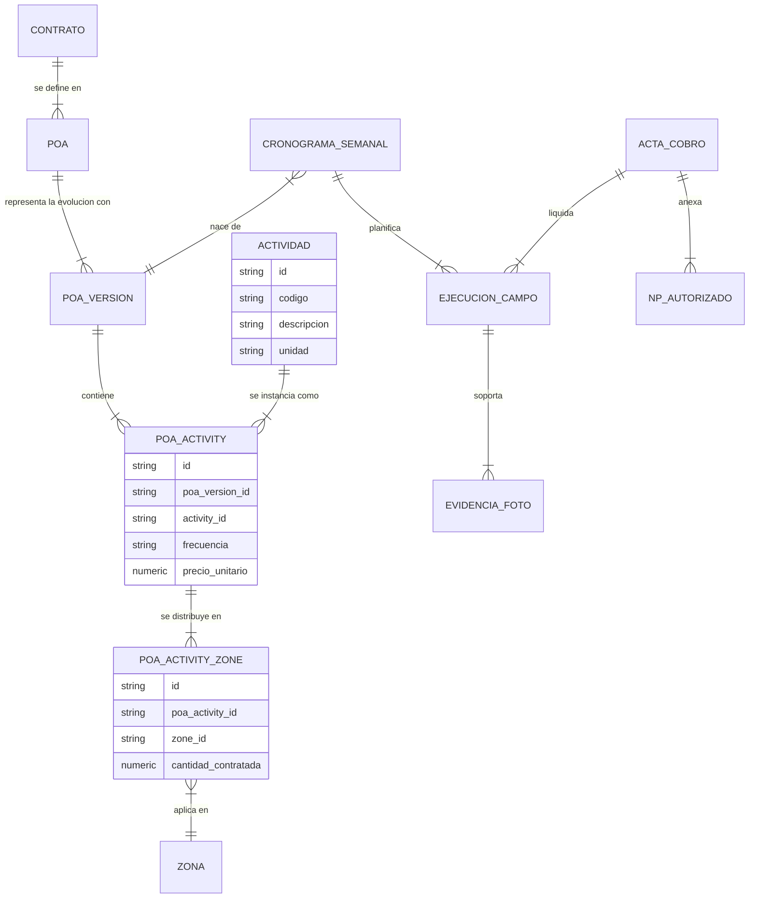
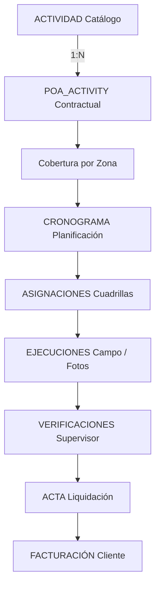
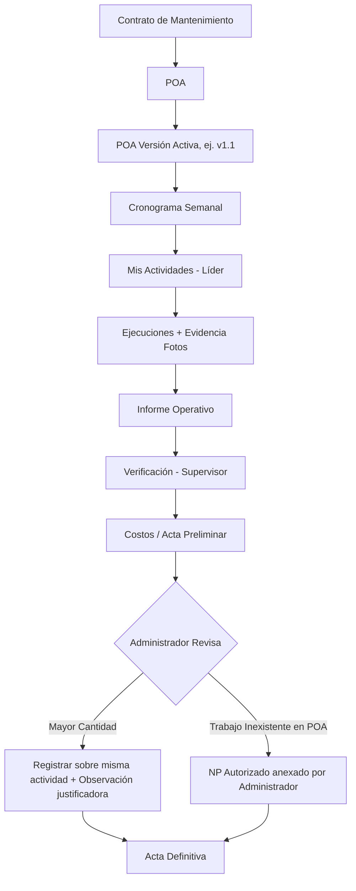

# Definición y Reglas del Dominio: POA (Plan Operativo Anual)

Este documento establece y congela el dominio conceptual del **Plan Operativo Anual (POA)**. Actúa como el contrato de negocio inmutable del cual derivan los desarrollos técnicos y lógicos de Mantenix.

---

## 1. Conceptos Fundamentales

### ¿Qué es el POA?
El POA representa el **instrumento contractual** que define la línea base operativa del contrato. Su evolución se representa mediante versiones aprobadas.
*   **No es un cronograma:** No contiene fechas de ejecución ni planificación temporal.
*   **No es un catálogo simple:** No es un listado de tareas arbitrarias; define los límites técnicos y financieros pactados.
*   **No es un presupuesto aislado:** Es la fuente de origen legal de donde nace el derecho a cobrar cada unidad de obra.

### Estructura de Versionamiento y Ciclo de Vida
El dominio del POA se organiza bajo la siguiente jerarquía conceptual de cuatro capas para garantizar la integridad histórica:
1.  **Contrato:** El contrato de mantenimiento principal (ej. *Contrato 2026*).
2.  **POA:** Instrumento contractual que define la línea base operativa del contrato.
3.  **Versión del POA:** Instantánea contractual aprobada del POA que contiene el catálogo contractual completo aplicable durante una vigencia determinada. Cada versión constituye una línea base inmutable.
4.  **Actividad del POA (POA_ACTIVITY):** Constituye la unidad contractual fundamental del sistema. Representa la incorporación de una Actividad del catálogo técnico dentro de una versión específica del POA y define las condiciones contractuales aplicables durante su vigencia, incluyendo el precio unitario y la frecuencia. Sobre esta entidad se sustentan la planificación, la programación, la ejecución, la verificación, la liquidación y la facturación del contrato. Toda información operativa deriva directa o indirectamente de una Actividad del POA y nunca modifica su definición contractual.

> [!IMPORTANT]
> **Separación de Catálogo y Contrato:** El POA referencia actividades del catálogo técnico. Las condiciones contractuales (precio, frecuencia, cantidades y zonas) pertenecen exclusivamente a la versión del POA. Los parámetros operativos, como rendimientos esperados o tiempos estándar, pertenecen al catálogo técnico del sistema y no al documento contractual.

> [!IMPORTANT]
> **Inmutabilidad y Trazabilidad:** Una versión del POA, una vez publicada y activa, es completamente **inmutable**. Cualquier modificación contractual (como otrosíes que alteren cantidades o precios) genera una **nueva versión del POA**. Las versiones anteriores nunca se editan ni se sobreescriben; se conservan íntegras para fines de auditoría histórica.

---

## 2. Principios Rectores y de Análisis

> [!TIP]
> **Principio de Desacoplamiento (Filosofía Mantenix):**
> *   **El POA define qué debe ejecutarse.**
> *   **El catálogo técnico define cómo se ejecuta.**
> *   **La operación registra qué se ejecutó.**
> *   **El acta determina qué se cobra.**

> [!TIP]
> **Principio General del Sistema:**
> El POA constituye el contrato operativo anual. Todas las actividades ejecutadas, verificadas, liquidadas y cobradas deben poder trazarse hasta una actividad de una versión específica del POA o, de manera excepcional, hasta un NP autorizado por el administrador. Ninguna otra fuente puede originar actividades operativas dentro del sistema.

> [!TIP]
> **Principio de Análisis:**
> La actividad constituye la unidad de análisis del sistema. Las zonas representan únicamente el contexto físico donde esa actividad se ejecuta. Todos los indicadores de rendimiento, costos, tiempos, productividad y cumplimiento se calculan comparando el comportamiento de una misma actividad entre zonas, periodos, líderes y cuadrillas.

> [!TIP]
> **Principio de Reproducibilidad Histórica:**
> Cualquier informe, indicador, costo, ejecución o acta generada en el pasado debe poder reconstruirse exactamente utilizando la versión del POA vigente al momento de su creación, independientemente de las versiones posteriores.

> [!IMPORTANT]
> **Desacoplamiento del Cronograma:**
> El cronograma constituye una representación temporal de planificación derivada de una versión específica del POA. No modifica, reemplaza ni complementa la información contractual contenida en la versión que le dio origen. Toda modificación contractual deberá realizarse exclusivamente mediante la publicación de una nueva versión del POA.

---

## 3. Glosario y Definiciones del Dominio

*   **Catálogo Técnico:** Repositorio permanente de actividades definido por Mantenix. Contiene la identidad técnica de cada actividad (código, descripción y unidad) y puede incorporar parámetros operativos como rendimientos esperados, tiempos estándar u otras referencias utilizadas para la planificación y el análisis. No define condiciones económicas ni cantidades contratadas.
*   **Catálogo Contractual:** Conjunto de Actividades del POA pertenecientes a una versión específica. Constituye el universo de actividades que pueden programarse y facturarse durante la vigencia de esa versión.
*   **Actividad:** Definición técnica permanente e independiente de cualquier contrato. Representa una labor identificada mediante un código único, descripción y unidad de medida. No contiene información económica ni cantidades contratadas.
*   **Versión del POA:** Instantánea contractual aprobada del POA que contiene el catálogo contractual completo aplicable durante una vigencia determinada. Cada versión constituye una línea base inmutable.
*   **Actividad del POA (POA_ACTIVITY):** Constituye la unidad contractual fundamental del sistema. Representa la incorporación de una Actividad del catálogo técnico dentro de una versión específica del POA y define las condiciones contractuales aplicables durante su vigencia, incluyendo el precio unitario y la frecuencia. Sobre esta entidad se sustentan la planificación, la programación, la ejecución, la verificación, la liquidación y la facturación del contrato. Toda información operativa deriva directa o indirectamente de una Actividad del POA y nunca modifica su definición contractual.
*   **Cobertura por Zona (POA_ACTIVITY_ZONE):** Entidad contractual que representa la asignación y cantidad contratada de una Actividad del POA para una zona específica dentro de esa versión.
*   **Precio Unitario:** Valor económico contractual asignado a una Actividad del POA dentro de una versión determinada. Constituye la base para la liquidación económica de las cantidades ejecutadas.
*   **Zona:** Unidad espacial del contrato sobre la cual se programan y ejecutan las actividades. Una actividad puede existir en una, varias o todas las zonas definidas por el POA.
*   **Frecuencia:** La frecuencia contractual representa la periodicidad mínima exigida por el contrato y constituye el insumo utilizado por el motor de planificación para generar automáticamente los cronogramas a partir del POA. Cada actividad del POA posee una única frecuencia, independientemente de las zonas donde se ejecute, o ninguna: una Actividad del POA puede permanecer contratada sin tener programación periódica asignada en una versión determinada. En ese caso, la actividad no genera cronograma automático hasta que una versión posterior del POA le asigne frecuencia — la ausencia de frecuencia no constituye un error ni afecta la vigencia de la Cantidad Contratada.
*   **Rendimiento Esperado:** Valor de referencia utilizado para medir la productividad de una actividad (por ejemplo, m²/JR). No forma parte del contenido contractual del POA; proviene del catálogo técnico utilizado por Mantenix para planificar y analizar el desempeño. El rendimiento esperado nunca afecta el cálculo contractual ni la facturación. Su único propósito es apoyar la planificación, la medición de productividad y el análisis de desempeño.
*   **Cantidad Contratada:** Cantidad contractual asignada a una Actividad del POA para una zona específica durante la vigencia de una versión del POA. La cantidad ejecutada podrá ser inferior, igual o superior a la cantidad contratada. La ejecución no modifica la cantidad contractual. Cuando la cantidad ejecutada supere la cantidad contratada deberá registrarse la justificación correspondiente, sin alterar la definición contractual de la Actividad del POA.
*   **NP (No Previsto):** Trabajo o actividad extraordinaria que **no pertenece a ninguna de las actividades de la versión activa del POA** y cuya necesidad surge de manera imprevista durante la operación.
*   **Evidencia Operativa:** Fotografías, firmas, coordenadas y reportes de estado cargados en campo que respaldan y certifican la ejecución de cada cantidad.
*   **Cronograma Semanal:** Plan operativo generado automáticamente a partir de una versión específica del POA. Organiza en el tiempo las actividades contractuales que deberán ejecutar las cuadrillas.
*   **Versión Vigente:** Versión del POA utilizada para generar nuevos cronogramas. La existencia de una versión vigente no modifica la información creada a partir de versiones anteriores.
*   **Vigencia:** Intervalo de tiempo durante el cual una versión del POA puede utilizarse para generar nuevos cronogramas. La vigencia de una versión finaliza cuando se publica una nueva versión que la reemplaza, o cuando finaliza la vigencia del contrato al cual pertenece.

---

## 4. Reglas de Negocio Contractuales (Invariantes)

### Regla 1: Inmutabilidad por Versiones
Cada versión aprobada del POA constituirá una línea base contractual. Una vez publicada, dicha versión será inmutable. Toda modificación contractual generará una nueva versión del POA; ninguna versión existente podrá editarse.

### Regla 2: Origen del Cronograma
El Cronograma semanal siempre nacerá de una versión específica y aprobada del POA (ej. POA v1.1). Ninguna actividad nueva podrá crearse directamente desde el Cronograma.

### Regla 3: Restricción de Roles en Campo
El líder o técnico en campo únicamente podrá ejecutar actividades asignadas y existentes en el cronograma semanal. En ningún caso podrá crear ni modificar actividades.

### Regla 4: Gestión de Excedentes de Cantidad
Si la cantidad ejecutada supera la cantidad contratada:
1.  Deberá registrarse sobre la misma actividad existente del POA.
2.  El administrador deberá ingresar una observación justificando el exceso antes del cobro.
3.  El exceso mantendrá el código, unidad y condiciones contractuales de la versión del POA desde la cual fue ejecutado.
4.  No podrá crearse una actividad NP.

### Regla 5: Definición Estricta de NP
Únicamente se considerará NP un trabajo cuya naturaleza no corresponda a ninguna actividad del catálogo contractual de la versión vigente del POA.

### Regla 6: Registro y Autorización de NP
Los NP únicamente podrán ser registrados por el administrador. La aprobación del NP ocurrirá fuera del sistema; la aplicación registrará su incorporación al acta correspondiente y conservará su trazabilidad histórica.

### Regla 7: Flujo del Acta de Cobro
Las actas de avance se generarán de forma automática a partir de las ejecuciones físicas reportadas por los líderes en campo. Los NP autorizados deberán anexarse de forma manual por el administrador antes de realizar el cierre definitivo del acta mensual.

### Regla 8: Conservación de la Trazabilidad
Toda ejecución, cronograma, informe, fotografía, verificación, costo y acta deberán conservar la referencia a la versión del POA con la cual fueron generados. La publicación de una nueva versión del POA no modificará ni recalculará información histórica.

### Regla 9: Catálogo Contractual Inmutable
Durante la operación no podrán crearse, eliminarse ni modificarse actividades pertenecientes a una versión del POA. Los NP no modificarán el catálogo contractual ni la versión del POA sobre la cual se ejecutó el contrato; únicamente se incorporarán al proceso de facturación mediante el acta correspondiente. La única forma de modificar el catálogo contractual será la publicación de una nueva versión del POA. Las versiones anteriores permanecerán disponibles únicamente para consulta y trazabilidad.

### Regla 10: Evidencia Operativa
Las fotografías y demás evidencias únicamente podrán ser registradas por los líderes durante la ejecución de las actividades. Dichas evidencias alimentarán los informes operativos y servirán como soporte para la elaboración del acta. El administrador únicamente podrá complementar el acta con los NP autorizados cuando corresponda.

### Regla 11: Comparabilidad del Rendimiento
El rendimiento operativo se analizará por actividad contractual y podrá compararse entre diferentes zonas, líderes, cuadrillas y periodos. Las zonas representarán únicamente el contexto de ejecución y no alterarán la identidad técnica de la actividad.

### Regla 12: Versión Activa Única
Para un mismo contrato únicamente podrá existir una versión vigente del POA utilizada para generar nuevos cronogramas. La publicación de una nueva versión únicamente afectará la generación de nuevos cronogramas; las versiones anteriores permanecerán disponibles únicamente para consulta histórica y trazabilidad.

### Regla 13: Origen Exclusivo de Actividades
Toda actividad utilizada por el cronograma, las ejecuciones, los informes, los costos y las actas deberá provenir de una Actividad del POA perteneciente a una versión aprobada, salvo los NP registrados por el administrador.

### Regla 14: Origen Único del Cobro
Toda cantidad incluida en un acta definitiva deberá tener exactamente uno de estos orígenes:
*   Una Actividad del POA perteneciente a la versión utilizada para generar el cronograma; o
*   Un NP registrado por el administrador.
No existirán otros orígenes válidos de facturación dentro del sistema.

### Regla 15: Congelación Contractual de la Ejecución
Una vez generado un cronograma, todas las actividades programadas conservarán la referencia a la versión del POA que les dio origen, incluso si posteriormente se publica una nueva versión del POA.

### Regla 16: No Mezcla de Versiones
Un mismo cronograma semanal únicamente podrá originarse a partir de una única versión del POA.

### Regla 17: Inmutabilidad del Precio
El precio unitario asociado a una Actividad del POA permanecerá inalterable durante toda la vigencia de la versión correspondiente. Cualquier modificación del precio únicamente podrá realizarse mediante la publicación de una nueva versión del POA.

### Regla 18: Inmutabilidad de la Frecuencia
La frecuencia contractual definida para una Actividad del POA permanecerá inalterable durante toda la vigencia de la versión correspondiente. Su modificación únicamente podrá realizarse mediante la publicación de una nueva versión del POA.

### Regla 19: Conservación Histórica
Ninguna entidad contractual que haya sido utilizada por cronogramas, programaciones, ejecuciones, actas, novedades de pago o cualquier otro registro operativo podrá eliminarse físicamente del sistema. La preservación de la trazabilidad histórica prevalecerá sobre cualquier operación administrativa.

---

## 5. Diagramas de Dominio y Flujos

### Diagrama Entidad-Relación Conceptual del Dominio

### Cadena de Trazabilidad del Negocio
El sistema garantiza que toda la cadena operativa y financiera mantenga la trazabilidad inquebrantable desde el Catálogo hasta la Facturación:

### Diagrama del Flujo del Negocio

