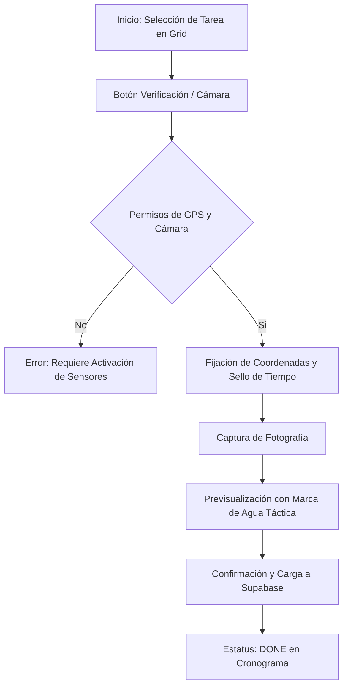

# 📖 Manual de Operación: Verificación Fotográfica con GPS
**Sistema:** Mantenix Tactical Ops  
**Módulo:** Auditoría de Campo y Evidencia irrefutable  
**Versión:** 1.0.1  

## 1. Resumen Ejecutivo
### ¿El Por qué?
En las operaciones de mantenimiento de activos extensos, la mayor fricción es la falta de confianza en los reportes de campo. Este módulo elimina la duda al "sellar" cada actividad con una prueba física (foto) y digital (GPS + Timestamp), garantizando que el trabajo se realizó en el lugar y momento adecuados.

### ¿Para quién?
*   **Operarios de Campo:** Para certificar su cumplimiento de forma rápida.
*   **Supervisores / Clientes:** Para auditar la calidad y ubicación de la ejecución desde el dashboard central de forma remota.

---

## 2. Especificaciones Técnicas (Infraestructura Táctica)

| Componente | Tecnología | Función |
| :--- | :--- | :--- |
| **Geo-Location API** | Browser Native | Captura de coordenadas Lat/Lng con precisión de hasta 5 metros. |
| **Secure Camera Access** | HTML5 Media Capture | Apertura forzada de cámara trasera para evitar selección de fotos antiguas. |
| **Sello Digital** | Metadata Injection | Incrustación de coordenadas y marca de tiempo en el cuerpo de la foto. |
| **Almacenamiento** | Supabase Storage | Canal de carga optimizado para evitar pérdida de datos en zonas de baja señal. |

---

## 3. Flujo de Usuario (User Flow)

---

## 4. Casos de Borde y Manejo de Errores (Edge Cases)

| Situación | Comportamiento del Sistema | Acción del Usuario del Operario |
| :--- | :--- | :--- |
| **Falla de Cobertura GPS** | El sistema notificará "Sincronizando..." durante 5 seg. Si falla, el sello marcará "Coordenadas N/A". | Asegurarse de estar en un área abierta (cielo despejado) si la precisión es crítica. |
| **Pérdida de Conexión (Offline)** | Mantenix retendrá la imagen en caché local (IndexedDB) temporalmente. | No cerrar la aplicación hasta que la barra de sincronización llegue al 100%. |
| **Permiso de Cámara Denegado** | El botón de captura quedará inhabilitado con un mensaje de advertencia. | Ir a Configuraciones del Navegador > Privacidad > Activar Cámara para Mantenix. |
| **Batería Baja (<10%)** | El sistema desactiva el renderizado de alta resolución para ahorrar energía. | Conecta el dispositivo o reporta la carga antes de continuar. |

---

## 5. Guía de Solución de Problemas (Troubleshooting)

1.  **"La foto se queda en Sincronizando..."**:
    *   Verifica que los datos móviles estén activos.
    *   Si el archivo es muy pesado, el sistema puede tardar hasta 10 segundos en redes 3G.
2.  **"El mapa de fondo no carga"**:
    *   Esto no afecta la captura de la evidencia. El sistema sigue capturando coordenadas aunque el mapa de referencia falle. Sigue adelante con la toma.
3.  **"No aparece la marca de agua con la hora"**:
    *   Asegurarte de que la hora de tu dispositivo esté configurada en "Automático". El sistema rechaza marcas de tiempo manuales para evitar fraudes.
